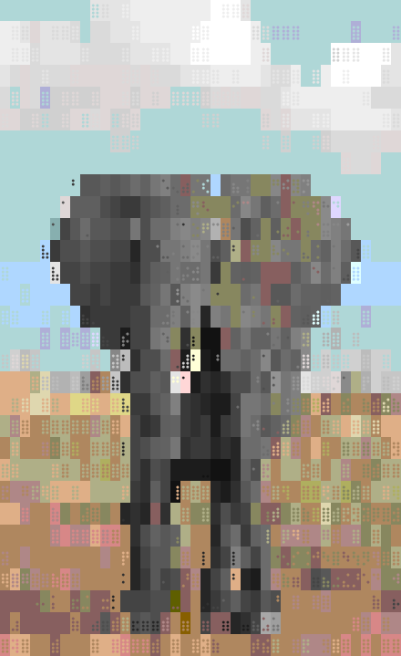

# Pic2Braille
Pic2Braille is a picture to text converter written in Python.

## Usage
```console
$ python3 pic2braille.py -file elephant.jpg -size 80
```
will show a picture of elephant in colored [braille characters](https://en.wikipedia.org/wiki/Braille_Patterns)



which is converted from the following image file.

https://en.wikipedia.org/wiki/Elephant#/media/File:African_Bush_Elephant.jpg

## Requirements
- You will need to install OpenCV2
```console
$ conda install -c conda-forge opencv
```

## Rationale
This is a pilot project started as using braille characters as a dot display.

A braille character has a 2x4 dot pattern in its font shape.
As conventional terminal contains 80x25 of such unicode chatacters,
we can construct a 160x100 dot display in total using only braille characters.

In order to add a coloring flavor to the 160x100 monochrome display,
OpenCV2 and [ANSI escape code](https://en.wikipedia.org/wiki/ANSI_escape_code) are used in the following steps.
OpenCV2 parses the input image file and then separates gray scale values from RGB color values.
At this step OpenCV2 will rescale the image if necessary.

After that, we convert RGB color to ANSI escape code.
As we can have two different colors for text and background in a terminal,
we sample two RGB values from 2x4 dots in the rescaled image.
Specifically, we use majority vote of 2x4 dots as our measure,
selecting the most common as background and the second most common as text.
It is because background occupies more parts of screen than text.

We have two lessons learned from this project:
- Fitting the color selection to the input image file is the most crucial part
- Showing braille characters in color can be the slowest part in a terminal
    - For example, you can use this as a benchmark for comparing WSL1 and WSL2
